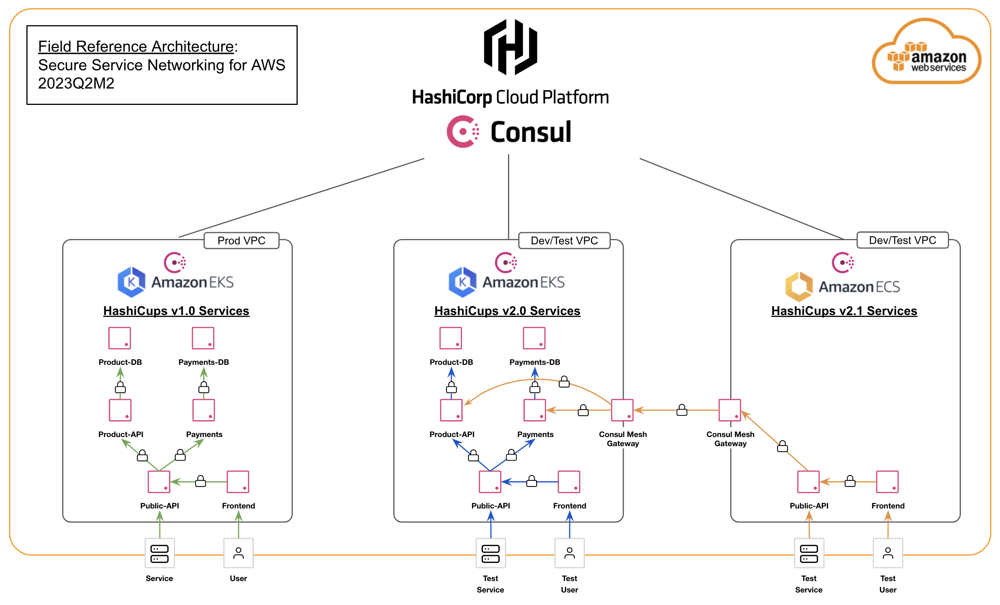

# secure-service-networking-for-aws
Secure Service Networking for AWS w/ HashiCorp Consul

## Table of Contents

- [Architecture Overview](#Architecture%20Overview) 
- [Build Environment](#Build%20Environment) 
- [Obtain AWS credentials](#Obtain%20AWS%20credentials) 
- [Obtain HCP credentials](#Obtain%20HCP%20credentials) 
- [Troubleshooting](#Troubleshooting)

---

# Architecture Overview

Using AWS and HCP Credentials, you can create this architecture from a single `terraform apply` command (approx 35 mins build time).



---
# Build Environment

Executing this terraform definition will recreate the environment from the "Secure Service Networking for AWS" Instruqt workshop:
https://play.instruqt.com/hashicorp/tracks/secure-service-networking-for-aws


To run this you will need to set the following environment variables:

```sh
AWS_ACCESS_KEY_ID
AWS_SECRET_ACCESS_KEY
HCP_CLIENT_ID
HCP_CLIENT_SECRET
```

For example:
```sh
export HCP_CLIENT_ID=XxXx1xx47X5x4xxXxxXXXx0Xxx8xxxXX
export HCP_CLIENT_SECRET=Xxxx16xX2XXxXXxXxxx2xxxXxXXXxxxxXX0XxxXx_Xx4x09XxxXxxxxxxxxxxx9X
export AWS_ACCESS_KEY_ID=XXXXXXXXXXXX6XXXXXX
export AWS_SECRET_ACCESS_KEY=Xx7XX9XxXXXXxxxXXx/xXXXXxx7xXXXxXXXxXXxX
```

Then:
```sh
terraform init
terraform plan
terraform apply
```

Approximately 25 - 30 minutes later you will receive the three HashiCups URLs for the three environments: EKS prod, EKS Dev, and ECS Dev.

To access the HCP Consul UI, first fetch the ACL token so that you can login using the following command:

`terraform output hcp_acl_token_secret_id`

---
# Obtain AWS credentials

In this section well cover creating/retrieving your AWS_ACCESS_KEY_ID and AWS_SECRET_ACCESS_KEY values

Scroll down to Programmatic Access in the following document:

https://docs.aws.amazon.com/general/latest/gr/aws-sec-cred-types.html

---
# Obtain HCP credentials

Obtaining your HCP_CLIENT_ID and  HCP_CLIENT_SECRET

First navigate to the *HCP Consul* tab - this will open a new window.

1. Click the 'Sign Up' button.

2. In the left panel, navigate to "Access control (IAM)"

3. Scroll down to "Service Principals"

4. Click "Create service principal".

5. Give the service principal a name, e.g. 'aws-workshop'

6. Leave the Role as 'Contributor' and click 'Save'

7. Copy the 'Client ID' and the 'Client Secret' somewhere locally as you will need them soon.

---
# Troubleshooting

Tested with the following versions:

```sh
Terraform v1.1.9
on darwin_amd64
+ provider registry.terraform.io/gavinbunney/kubectl v1.14.0
+ provider registry.terraform.io/hashicorp/aws v3.75.1
+ provider registry.terraform.io/hashicorp/cloudinit v2.2.0
+ provider registry.terraform.io/hashicorp/consul v2.15.1
+ provider registry.terraform.io/hashicorp/hcp v0.26.0
+ provider registry.terraform.io/hashicorp/helm v2.5.1
+ provider registry.terraform.io/hashicorp/http v2.1.0
+ provider registry.terraform.io/hashicorp/kubernetes v2.11.0
+ provider registry.terraform.io/hashicorp/local v2.2.2
+ provider registry.terraform.io/hashicorp/random v3.1.3
+ provider registry.terraform.io/hashicorp/template v2.2.0
+ provider registry.terraform.io/hashicorp/tls v3.3.0
+ provider registry.terraform.io/terraform-aws-modules/http v2.4.1
```

Troubleshooting steps have been moved to the `./DOCS` folder:
[TROUBLESHOOTING.md](./DOCS/TROUBLESHOOTING.md)

---